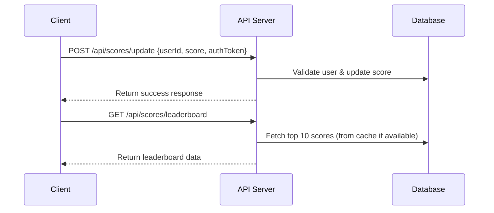

# API Service Specification

## Overview
This document describes the API service responsible for handling user scores in a scoreboard system. The API allows users to update their scores upon completing certain actions, ensuring real-time leaderboard updates while preventing unauthorized score manipulation.

## Features
1. **Real-time Scoreboard Updates**: The system updates the scoreboard dynamically as users complete actions.
2. **Secure Score Submission**: Ensures that only authenticated and authorized users can modify their scores.
3. **Top 10 Leaderboard**: Maintains a ranking of the top 10 users with the highest scores.
4. **Rate Limiting & Anti-Cheating Measures**: Prevents spam and unauthorized score inflation.

## API Endpoints

### **1. Submit Score**
- **Endpoint**: `POST /api/scores/update`
- **Description**: Updates the user score when an action is completed.
- **Request Body**:
    ```json
    {
      "userId": "string",
      "score": "number",
      "authToken": "string"
    }
    ```
- **Response**:
    ```json
    {
      "success": true,
      "message": "Score updated successfully",
      "newScore": "number"
    }
    ```
- **Security Measures**:
  - Requires a valid `authToken` for authentication.
  - Uses server-side validation to prevent unauthorized score modifications.
  - Applies rate limiting (e.g., a user can only update a score a limited number of times per minute).

### **2. Get Leaderboard**
- **Endpoint**: `GET /api/scores/leaderboard`
- **Description**: Retrieves the top 10 users with the highest scores.
- **Response**:
    ```json
    {
      "leaderboard": [
        {"userId": "string", "score": "number"},
        {"userId": "string", "score": "number"}
      ]
    }
    ```
- **Performance Optimization**:
  - Uses caching (e.g., Redis) to reduce database queries.
  - Ensures sorted retrieval of top scores for efficiency.

## Architecture & Execution Flow



## Security & Anti-Cheating Measures
- **JWT Authentication**: Ensures only authenticated users can update scores.
- **Rate Limiting**: Prevents abuse by limiting score update frequency.
- **Server-side Validation**: Verifies that scores are not manipulated client-side.
- **Audit Logs**: Logs suspicious activities for further review.
- **WebSocket for Live Updates**: Pushes updates to clients instead of polling.

## Suggested Improvements
- Implement **WebSocket or Server-Sent Events (SSE)** for real-time leaderboard updates instead of polling.
- Use **Redis caching** to enhance performance in leaderboard retrieval.
- Introduce an **AI-based anomaly detection system** to identify suspicious score patterns.

---
This specification provides a foundation for the backend engineering team to implement the API service effectively.

